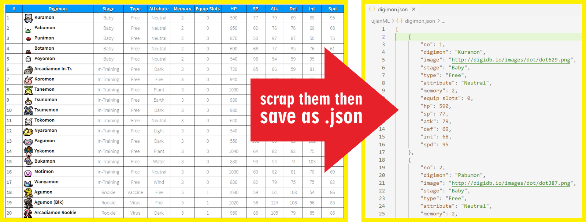

# Soal Ujian Data Science - Machine Learning


                  
    

## **Soal 2 - Scraping Digimon to JSON**

Tersedia data lengkap __341 Digimon__ di laman [__DigiDB.io__](http://digidb.io/digimon-list/). Buatlah sebuah file __python (.py)__ dan gunakan teknik _web scraping_ untuk mengekstrak data di laman tersebut, kemudian _export_ semua data sebagai file __JSON (digimon.json)__ dengan struktur data sebagai berikut:

```javascript
...,
{
    "no": 46,
    "digimon": "Patamon",
    "image": "http://digidb.io/images/dot/dot096.png",
    "stage": "Rookie",
    "type": "Data",
    "attribute": "Wind",
    "memory": 4,
    "equip slots": 1,
    "hp": 880,
    "sp": 93,
    "atk": 79,
    "def": 74,
    "int": 92,
    "spd": 90
},
...
```

Ilustrasi dari proses yang diharapkan:



✅ _Commit & push source code jawaban soal ini (beserta file output __digimon.json__) ke __Github__ Anda, buatlah repo dengan nama __Ujian_Digimon_Json__, kemudian lampirkan __url link repo Github__ Anda via email ke lintang@purwadhika.com!_

#

                  
    

### *__#HappyCoding__* :relaxed:

#### Lintang Wisesa :love_letter: _lintangwisesa@ymail.com_

[Facebook](https://www.facebook.com/lintangbagus) | 
[Twitter](https://twitter.com/Lintang_Wisesa) |
[Google+](https://plus.google.com/u/0/+LintangWisesa1) |
[Youtube](https://www.youtube.com/user/lintangbagus) | 
:octocat: [GitHub](https://github.com/LintangWisesa) |
[Hackster](https://www.hackster.io/lintangwisesa)
